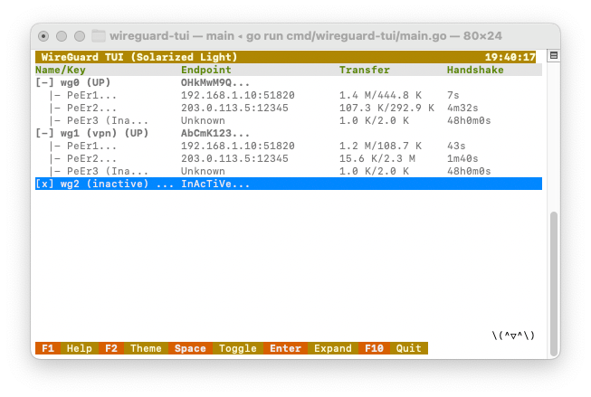

# WireGuard TUI

一个受 `htop` 启发，专为管理 WireGuard VPN 隧道而设计的精美终端用户界面 (TUI)。



## 功能特性

- **类 Htop 界面**：直观的树状视图，接口 (Interface) 为根，对端 (Peer) 为叶。
- **动态布局**：列宽根据终端窗口大小自动调整，完美利用屏幕空间。
- **可视化开关**：带有颜色编码的 `[ON]` (绿) / `[OFF]` (红) 状态指示器。
- **详情面板**：底部面板实时展示选中接口或对端的详细配置信息。
- **多主题支持**：内置 5 款精美主题，一键切换 (`F2`)：
  - Htop Classic (经典)
  - Dracula (德古拉)
  - Solarized Light (日式明亮)
  - Nord (北极蓝)
  - Tokyo Night (东京夜)
- **实时监控**：实时刷新握手时间 (Handshake) 和传输流量 (Transfer) 数据。
- **快捷控制**：按 `Space` 空格键快速切换接口的 启动/停止 状态。
- **展开/折叠**：按 `Enter` 回车键查看或隐藏对端详情。
- **吉祥物**：右下角集成了动态 ASCII 吉祥物，随状态变化。

## 安装说明

### 前置要求

- Go 1.21 或更高版本
- 已安装并配置好 WireGuard
- Root/Sudo 权限 (用于调用 `wg-quick` 和 `wg` 命令管理网络接口)

### 源码编译

```bash
git clone https://github.com/lakecass/wireguard-tui.git
cd wireguard-tui
go build -o wg-tui cmd/wireguard-tui/main.go
```

### 安装

```bash
sudo mv wg-tui /usr/local/bin/
```

## 使用指南

### 运行

```bash
# 在 Linux 上运行 (需要真实 WireGuard 环境)
sudo wg-tui

# 演示模式 (无需 WireGuard，用于体验界面)
wg-tui -mock
```

### 键盘快捷键

- `↑`/`↓` 或 `k`/`j`：上下导航
- `Space`：切换接口 开启/关闭 (UP/DOWN)
- `Enter`：展开/折叠 接口详情
- `F2`：切换颜色主题
- `F10` 或 `q`：退出程序

## 配置文件结构

本程序会自动读取 `/etc/wireguard/*.conf` 下的配置文件。

配置目录结构示例：
```
/etc/wireguard/
├── wg0.conf
├── wg1.conf
└── wg2.conf
```

## 工作原理

- **自动扫描**：自动检测 `/etc/wireguard/` 目录下的所有配置文件。
- **状态检测**：使用 `wg show` 命令实时获取接口的运行状态。
- **开关控制**：调用 `wg-quick up/down` 来管理接口的启动和停止。
- **实时数据**：持续更新对端的握手时间和流量统计。

## 开发指南

### 本地模拟开发

如果你在非 Linux 环境（如 macOS/Windows）或没有 WireGuard 环境下开发，可以使用模拟模式：

```bash
go run cmd/wireguard-tui/main.go -mock
```

### 项目结构

```
wireguard-tui/
├── cmd/
│   └── wireguard-tui/
│       └── main.go          # 程序入口
├── internal/
│   ├── ui/
│   │   ├── model.go         # Bubbletea UI 模型
│   │   ├── theme.go         # 颜色主题定义
│   │   └── mascot.go        # 吉祥物动画
│   └── wg/
│       ├── client.go        # WireGuard 客户端接口
│       ├── linux.go         # Linux 真实环境实现
│       └── mock.go          # 模拟环境实现
├── docs/
│   └── screenshot.png       # 截图文件
├── go.mod
├── go.sum
└── README.md
```

## 许可证

MIT License - 详见 LICENSE 文件

## 贡献

欢迎提交 Pull Request 或 Issue 来改进这个项目！

## 致谢

- 基于 [Bubble Tea](https://github.com/charmbracelet/bubbletea) 框架构建
- 使用 [Lip Gloss](https://github.com/charmbracelet/lipgloss) 进行样式渲染
