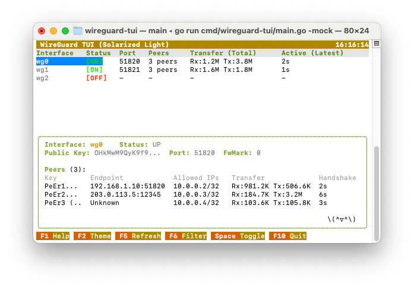
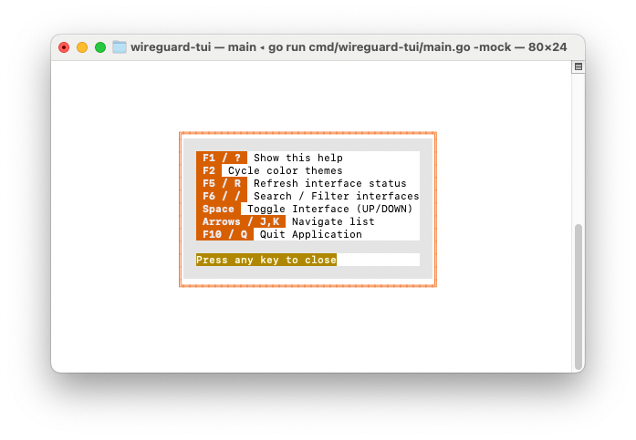
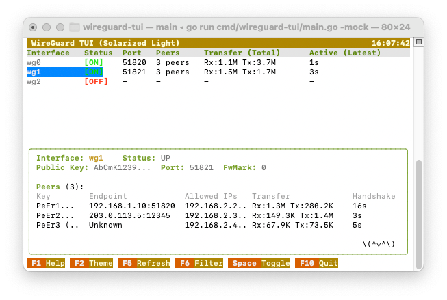
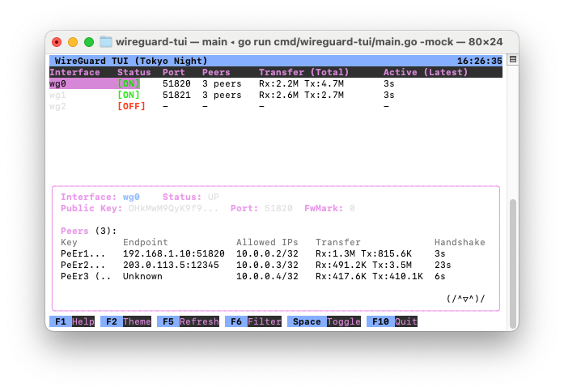

# WireGuard TUI (Htop Classic)

[](https://www.gnu.org/licenses/gpl-3.0)
[](https://goreportcard.com/report/github.com/lakecass/wireguard-tui)

**WireGuard TUI** 是一款现代化的、基于终端的 WireGuard 接口管理与监控工具。灵感源自传奇的 `htop`，它以极具美感的设计提供了高密度的实时分析、聚合流量统计和直观的管理功能。


## ✨ 核心特性

- **📊 高密度仪表盘**：通过 6 列深度分析（接口、状态、端口、Peer数、总流量和活跃度）一目了然地查看所有接口。
- **📉 实时数据聚合**：自动从所有 Peer 中汇总流量（Rx/Tx）和握手数据，展示接口级的性能表现。
- **🎨 多主题支持**：内置 **Dracula**, **Nord**, **Tokyo Night**, 和 **Solarized Light** 等高级主题。
- **🔍 高级过滤**：闪电般的实时搜索，轻松管理数十个隧道。
- **⌨️ 直观键位**：无需离开键盘即可完全控制你的网络。
- **🛡️ 健壮的错误处理**：针对后端问题（权限、缺失工具等）提供非侵入式的状态报告。
- **⚡ Go 语言构建**：极速性能，除 `wireguard-tools` 外无外部依赖。

## 🖼️ 界面展示

| **Tokyo Night 主题** | **Solarized Light 主题** |
| :---: | :---: |
|  |  |
| **详细信息与 Peer 列表** | **帮助菜单** |
|  |  |

## 🚀 安装指南

### Debian / Ubuntu
从 [发布页面](https://github.com/lakecass/wireguard-tui/releases) 下载最新的 `.deb` 安装包，并使用 dpkg 安装：
```bash
sudo dpkg -i wireguard-tui_0.1.0_amd64.deb
```

### Arch Linux
可以使用 `packaging/` 目录下提供的 `PKGBUILD` 进行构建：
```bash
cd packaging/arch
makepkg -si
```

### 源码编译
```bash
make build
sudo cp wireguard-tui /usr/bin/
```

## 🎮 使用方法

运行程序需要 `sudo` 权限（以通过 `wg show` 获取内核信息）：
```bash
sudo wireguard-tui
```

### 常用快捷键
| 按键 | 功能说明 |
| --- | --- |
| `F1` / `?` | 显示帮助与制作人信息 |
| `F2` | 切换配色方案 |
| `F5` / `R` | 手动刷新数据 |
| `F6` / `/` | 搜索/过滤接口 |
| `Space` | 切换接口状态 (UP/DOWN) |
| `Arrows` / `J,K` | 列表自由导航 |
| `F10` / `Q` | 退出程序 |

## 🛠️ 环境要求
- 支持 WireGuard 的 Linux 内核
- `wireguard-tools` (提供 `wg` 命令)

## 🤝 制作团队
由 **lakecass** 与 **Gemini** 联合倾情打造。

## 📄 开源协议
本项目采用 **GPL-3.0 协议** 开源。详情参见 [LICENSE](LICENSE) 文件。
